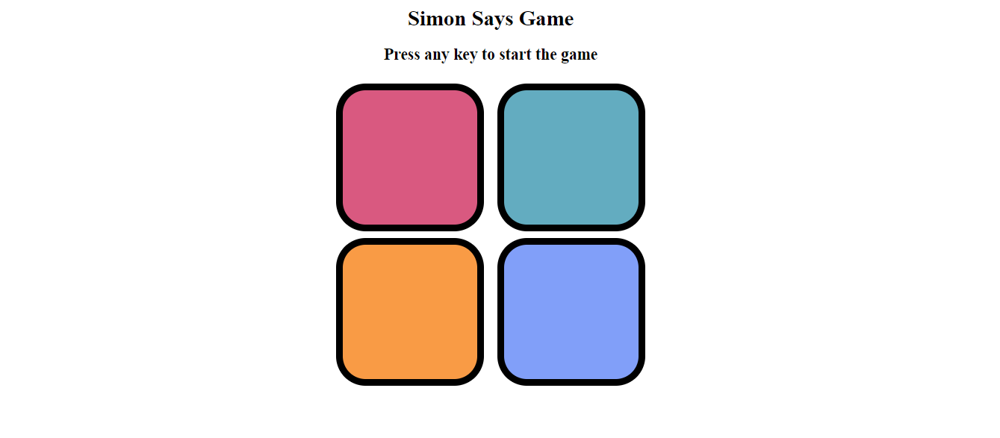

# 🎮 Simon Says Game

**Simon Says** is a classic memory-based browser game built with **HTML, CSS, and JavaScript**. The player must repeat an ever-growing sequence of colored buttons shown on the screen. With every successful round, the sequence gets longer — testing your memory and focus.

This project was developed as part of my journey in frontend development, to improve my skills in **DOM manipulation**, **event handling**, and responsive UI design using vanilla JavaScript.

---

## 🔗 Live Demo

👉 [Play Simon Says Game](

---

## 📸 Preview

---

## 🧠 How to Play

1. Press any key or click "Start" to begin the game.
2. A color will light up.
3. You must click the colors in **the exact order** they appear.
4. Each level adds one new color to the sequence.
5. A wrong click will end the game and show a Game Over message.

---

## ✨ Features

- Level-wise difficulty increases
- Color button animations
- Visual Game Over alert
- Clean and responsive layout
- Simple restart with keyboard

---

## 🛠️ Built With

- **HTML5** – Markup
- **CSS3** – Styling and layout
- **JavaScript (Vanilla)** – Logic and interactivity

---

## 📁 Project Structure

simon-says/

│
├── index.html # Main game page

├── styles.css # CSS for design and layout

├── script.js # Game logic

├── screenshot.png # Game preview image

└── README.md # Project documentation

---

## 🚀 Future Enhancements

- Add sound effects on button clicks  
- Store high score using local storage  
- Dark/light mode theme  
- Difficulty selection (easy, medium, hard)

---

## 🙋‍♀️ Author

**Umra Mirza**  
🎓 BCA Student | 💻 Frontend Developer  
🔗 [GitHub](https://github.com/umramirza) • [LinkedIn](https://www.linkedin.com/in/umra-mirza-4525962a2)

---